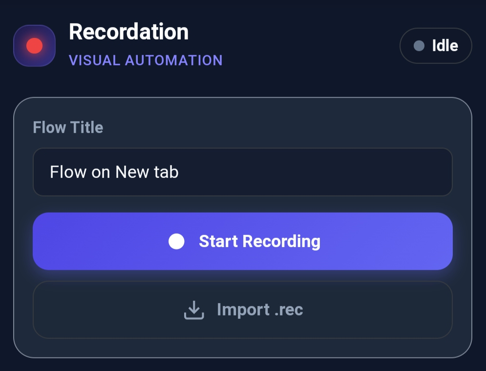
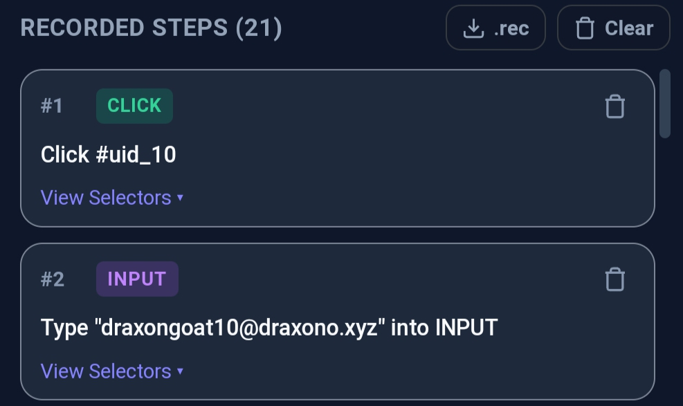

# Recordation

[](https://github.com/DraxonV1)
[](https://python.org)
[](https://developer.chrome.com/docs/extensions/mv3/intro/)
[](https://opensource.org/licenses/MIT)

A browser extension that records user interactions and exports them to executable browser automation (Python / Chrome Extension). Created by **DraxonV1**.

Captures user actions across Chromium browsers (mobile and desktop) into standardized `.rec` files, then compiles them into **TrueDriver Python scripts** (with automatic system Chrome binary discovery) or **standalone Chrome extensions** for direct replay.

---

## Features

- **In-Page Floating HUD:** Draggable overlay with step counter, recording state, pause/resume, and direct `.rec` export.
- **Multi-Strategy Selector Engine:** Generates resilient selector cascades per element:
  - Form attributes (`name`, `type`, `placeholder`)
  - Accessibility attributes (`aria-label`, `role`)
  - Test identifiers (`data-testid`, `data-cy`, `data-qa`)
  - Normalized text content for buttons, links, and dropdown options
  - Hierarchical CSS selectors and XPath expressions
- **Dynamic ID Filtering:** Automatically rejects transient framework identifiers (e.g. React `useId`, `uid_*`, `_r_*`).
- **Target Exporters:**
  - **TrueDriver (`export-py`):** Generates async Python scripts using TrueDriver with automated system Chrome binary resolution (`find_system_chrome()`).
  - **Standalone Extension (`export-ext`):** Compiles the recording into a standalone Manifest V3 extension ready for unpackaged loading and replay.
  - **Playwright (`export-playwright`):** Generates standard sync or async Playwright scripts.
- **Trace Optimizer (`optimize`):** Merges consecutive input sequences, removes rapid duplicate clicks within configurable thresholds, and normalizes delay intervals.
---

## Interface Preview

<p align="center">
  
  &nbsp;&nbsp;&nbsp;&nbsp;
  
</p>

---

## Architecture

```
recordation/
├── extension/                  # Chrome Extension (Manifest V3)
│   ├── manifest.json           # Extension manifest
│   ├── background.js           # Service worker & navigation listener
│   ├── content/
│   │   ├── selector-generator.js # Selector generation engine
│   │   ├── floating-hud.js     # Draggable HUD component
│   │   └── recorder.js         # Capture-phase event dispatcher
│   ├── popup/                  # Extension management interface
│   └── icons/                  # Application icons
├── python/
│   └── recordation/
│       ├── models.py           # Pydantic schemas for .rec specification
│       ├── optimizer.py        # Trace deduplication and normalization heuristics
│       ├── cli.py              # CLI entry points
│       └── exporters/
│           ├── truedriver_exporter.py # TrueDriver compiler
│           ├── extension_exporter.py  # Standalone extension compiler
│           └── playwright_exporter.py # Playwright compiler
├── examples/                   # Reference recording traces
├── pyproject.toml              # Build specification & dependencies
└── recordation-extension.zip   # Packaged extension archive
```

---

## Quickstart

### 1. Extension Installation

1. Download `recordation-extension.zip` or clone the repository.
2. Navigate to `chrome://extensions` in any Chromium browser.
3. Enable **Developer mode**.
4. Select **Load unpacked** and choose the `extension/` directory (or supply the ZIP package on supported mobile browsers).

### 2. Recording User Interactions

1. Navigate to the target web application.
2. Open the Recordation extension popup and click **Start Recording**.
3. The popup closes, and the on-screen HUD appears.
4. Execute interactions (clicks, keyboard input, selections, navigations).
5. Click **Save .rec** on the HUD or **Stop & Save** in the popup to download the recording file.

---

## CLI Reference

### Installation

```bash
git clone https://github.com/DraxonV1/Recordation.git
cd Recordation
pip install -e .
```

Verify installation:
```bash
recordation --version
```

### Commands

#### Inspect Recording Metadata
```bash
recordation info flow.rec
```

#### Enumerate Recorded Steps
```bash
recordation list flow.rec
```

#### Compile to TrueDriver (System Chrome)
Generates an automation script that resolves the local Chrome executable:
```bash
recordation export-py flow.rec -o automation.py

# Execute automation
python automation.py
```

#### Compile to Standalone Extension
Generates an unpacked Chrome Extension directory configured to replay the recorded flow:
```bash
recordation export-ext flow.rec -o ./runner_extension
```

To execute:
1. Load `./runner_extension` via **Extensions** -> **Load unpacked**.
2. Open the target domain and click **Run Automation** in the runner popup.

#### Compile to Playwright
```bash
recordation export-playwright flow.rec -o playwright_script.py
```

#### Optimize Recording Trace
```bash
recordation optimize flow.rec -o optimized.rec
```

---

## Format Specification (.rec)

Recordation traces follow a strict JSON schema:

```json
{
  "version": "1.0.0",
  "format": "recordation.rec",
  "metadata": {
    "title": "Registration Flow",
    "createdAt": "2026-09-24T12:00:00Z",
    "viewport": { "width": 412, "height": 915 },
    "startUrl": "https://example.com/signup"
  },
  "steps": [
    {
      "id": "step_1",
      "type": "navigate",
      "url": "https://example.com/signup",
      "timestamp": 1774430400000,
      "delayMs": 0
    },
    {
      "id": "step_2",
      "type": "input",
      "value": "user@example.com",
      "target": {
        "tag": "INPUT",
        "selectors": {
          "name": "email",
          "ariaLabel": "Email Address",
          "css": "input[name='email']",
          "xpath": "//input[@name='email']"
        }
      },
      "timestamp": 1774430401500,
      "delayMs": 1500
    }
  ]
}
```

---

## Testing

Execute the test suite using pytest:

```bash
pytest python/tests/test_recordation.py -v
```

---

## Author

Created by **[DraxonV1](https://github.com/DraxonV1)**.

---

## License

Distributed under the **MIT License**. See [`LICENSE`](LICENSE) for details.
